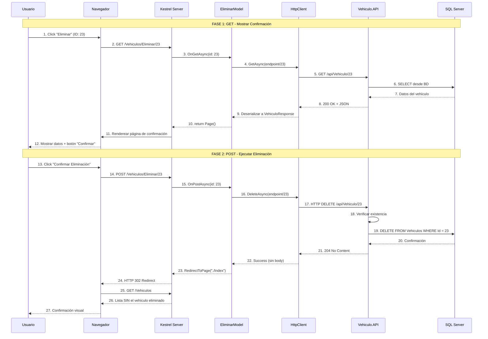

# Razor Pages - Eliminar Vehículo (Delete)

## 📘 Página de Confirmación y Eliminación

Este documento explica la implementación de la **página para eliminar un vehículo** con confirmación antes de ejecutar.

---

## 🎯 Objetivo

Mostrar los datos del vehículo a eliminar y pedir confirmación antes de ejecutar la eliminación permanente.

**URL**: `/Vehiculos/Eliminar/{id}`

**Métodos**: 
- **GET**: Mostrar confirmación con datos del vehículo
- **POST**: Ejecutar eliminación

---

## 🔄 Flujo Completo (GET + POST)



---

## 💻 Implementación

### 1. PageModel con DELETE Request

```csharp
// Pages/Vehiculos/Eliminar.cshtml.cs
using Microsoft.AspNetCore.Mvc;
using Microsoft.AspNetCore.Mvc.RazorPages;
using System.Text.Json;
using Abstracciones.Modelos;
using Abstracciones.Interfaces.Reglas;

namespace Vehiculos.WEB.Pages.Vehiculos
{
    public class EliminarModel : PageModel
    {
        private readonly IConfiguracion _configuracion;

        /// <summary>
        /// ⭐ Datos del vehículo a eliminar (solo lectura).
        /// NO se usa [BindProperty] porque no se edita.
        /// </summary>
        public VehiculoResponse? Vehiculo { get; set; }

        public int Id { get; set; }
        public string MensajeError { get; set; } = string.Empty;

        public EliminarModel(IConfiguracion configuracion)
        {
            _configuracion = configuracion;
        }

        /// <summary>
        /// GET: Mostrar datos del vehículo antes de eliminar.
        /// </summary>
        public async Task<IActionResult> OnGetAsync(int id)
        {
            Id = id;

            try
            {
                string endpoint = _configuracion.ObtenerMetodo("API", "Vehiculos");

                using var cliente = new HttpClient();

                // 1. Obtener datos del vehículo
                var respuesta = await cliente.GetAsync($"{endpoint}/{id}");

                // 2. Verificar existencia
                if (respuesta.StatusCode == System.Net.HttpStatusCode.NotFound)
                {
                    MensajeError = $"Vehículo con ID {id} no encontrado";
                    return Page();
                }

                respuesta.EnsureSuccessStatusCode();

                // 3. Deserializar
                var json = await respuesta.Content.ReadAsStringAsync();
                Vehiculo = JsonSerializer.Deserialize<VehiculoResponse>(json, new JsonSerializerOptions
                {
                    PropertyNameCaseInsensitive = true
                });

                if (Vehiculo == null)
                {
                    MensajeError = "No se pudo cargar la información del vehículo";
                    return Page();
                }

                return Page();
            }
            catch (HttpRequestException ex)
            {
                MensajeError = $"Error de conexión: {ex.Message}";
                return Page();
            }
            catch (Exception ex)
            {
                MensajeError = $"Error inesperado: {ex.Message}";
                return Page();
            }
        }

        /// <summary>
        /// POST: Ejecutar eliminación después de confirmación.
        /// </summary>
        public async Task<IActionResult> OnPostAsync(int id)
        {
            try
            {
                string endpoint = _configuracion.ObtenerMetodo("API", "Vehiculos");

                using var cliente = new HttpClient();

                // 1. ⭐ DELETE request
                var respuesta = await cliente.DeleteAsync($"{endpoint}/{id}");

                // 2. Verificar respuesta
                if (respuesta.StatusCode == System.Net.HttpStatusCode.NotFound)
                {
                    TempData["Mensaje"] = $"Vehículo {id} no encontrado. Es posible que ya haya sido eliminado.";
                    TempData["TipoMensaje"] = "warning";
                    return RedirectToPage("./Index");
                }

                // 3. ⭐ DELETE exitoso devuelve 204 No Content
                if (respuesta.StatusCode == System.Net.HttpStatusCode.NoContent)
                {
                    TempData["Mensaje"] = "Vehículo eliminado exitosamente";
                    TempData["TipoMensaje"] = "success";
                    return RedirectToPage("./Index");
                }

                // 4. Error inesperado
                var error = await respuesta.Content.ReadAsStringAsync();
                MensajeError = $"Error al eliminar: {respuesta.StatusCode} - {error}";
                
                // Re-cargar datos para mostrar de nuevo la confirmación
                Id = id;
                await OnGetAsync(id);
                return Page();
            }
            catch (HttpRequestException ex)
            {
                MensajeError = $"Error de conexión: {ex.Message}";
                Id = id;
                await OnGetAsync(id);
                return Page();
            }
            catch (Exception ex)
            {
                MensajeError = $"Error inesperado: {ex.Message}";
                Id = id;
                await OnGetAsync(id);
                return Page();
            }
        }
    }
}
```

**Características clave**:
- ✅ `OnGetAsync(int id)`: Carga datos para mostrar confirmación
- ✅ `OnPostAsync(int id)`: Ejecuta DELETE
- ✅ `DeleteAsync()`: HttpClient method para DELETE
- ✅ Status 204 No Content = éxito
- ✅ No hay [BindProperty] porque no se edita nada

---

### 2. Vista Razor con Mensaje de Advertencia

```html
@* Pages/Vehiculos/Eliminar.cshtml *@
@page "{id:int}"
@model Vehiculos.WEB.Pages.Vehiculos.EliminarModel
@{
    ViewData["Title"] = "Eliminar Vehículo";
}

<div class="container mt-4">
    <!-- Header -->
    <div class="row mb-4">
        <div class="col">
            <h1 class="display-5 text-danger">
                <i class="bi bi-exclamation-triangle-fill"></i> 
                Confirmar Eliminación
            </h1>
            <nav aria-label="breadcrumb">
                <ol class="breadcrumb">
                    <li class="breadcrumb-item"><a asp-page="./Index">Vehículos</a></li>
                    <li class="breadcrumb-item active">Eliminar</li>
                </ol>
            </nav>
        </div>
    </div>

    @if (!string.IsNullOrEmpty(Model.MensajeError))
    {
        <!-- Error al cargar vehículo -->
        <div class="alert alert-danger">
            <i class="bi bi-exclamation-triangle-fill"></i>
            <strong>Error:</strong> @Model.MensajeError
        </div>
        <a asp-page="./Index" class="btn btn-secondary">
            <i class="bi bi-arrow-left"></i> Volver al listado
        </a>
    }
    else if (Model.Vehiculo != null)
    {
        <!-- Mostrar confirmación -->
        <div class="row">
            <div class="col-lg-8 mx-auto">
                <!-- ⭐ Alert de advertencia -->
                <div class="alert alert-warning border-warning shadow" role="alert">
                    <h4 class="alert-heading">
                        <i class="bi bi-exclamation-triangle-fill"></i>
                        ¡Atención!
                    </h4>
                    <p class="mb-0">
                        Está a punto de <strong>eliminar permanentemente</strong> el siguiente vehículo. 
                        Esta acción <strong class="text-danger">NO SE PUEDE DESHACER</strong>.
                    </p>
                </div>

                <!-- Card con datos del vehículo -->
                <div class="card shadow-lg border-danger">
                    <div class="card-header bg-danger text-white">
                        <h3 class="mb-0">
                            <i class="bi bi-trash"></i>
                            Vehículo a Eliminar
                        </h3>
                    </div>

                    <div class="card-body p-4 bg-light">
                        <dl class="row">
                            <dt class="col-sm-4">ID:</dt>
                            <dd class="col-sm-8">@Model.Vehiculo.Id</dd>

                            <dt class="col-sm-4">Placa:</dt>
                            <dd class="col-sm-8">
                                <strong class="text-danger">@Model.Vehiculo.Placa</strong>
                            </dd>

                            <dt class="col-sm-4">Marca:</dt>
                            <dd class="col-sm-8">@Model.Vehiculo.NombreMarca</dd>

                            <dt class="col-sm-4">Modelo:</dt>
                            <dd class="col-sm-8">@Model.Vehiculo.NombreModelo</dd>

                            <dt class="col-sm-4">Color:</dt>
                            <dd class="col-sm-8">@Model.Vehiculo.Color</dd>

                            <dt class="col-sm-4">Año:</dt>
                            <dd class="col-sm-8">@Model.Vehiculo.Anio</dd>

                            <dt class="col-sm-4">Precio:</dt>
                            <dd class="col-sm-8">
                                <strong class="text-success">
                                    $@Model.Vehiculo.Precio.ToString("N2")
                                </strong>
                            </dd>

                            <dt class="col-sm-4">Propietario:</dt>
                            <dd class="col-sm-8">
                                @Model.Vehiculo.CorreoPropietario
                                <br />
                                <small class="text-muted">@Model.Vehiculo.TelefonoPropietario</small>
                            </dd>
                        </dl>
                    </div>

                    <div class="card-footer bg-white">
                        <!-- ⭐ Formulario POST con confirmación -->
                        <form method="post" onsubmit="return confirm('¿Está COMPLETAMENTE seguro de eliminar este vehículo? Esta acción es IRREVERSIBLE.');">
                            <div class="d-flex justify-content-between align-items-center">
                                <!-- Botón cancelar -->
                                <a asp-page="./Index" class="btn btn-secondary btn-lg">
                                    <i class="bi bi-x-circle"></i> Cancelar
                                </a>

                                <!-- Botón eliminar -->
                                <button type="submit" class="btn btn-danger btn-lg">
                                    <i class="bi bi-trash-fill"></i> 
                                    SÍ, Eliminar Permanentemente
                                </button>
                            </div>
                        </form>
                    </div>
                </div>

                <!-- Mensaje informativo sobre referencias -->
                <div class="alert alert-info mt-4">
                    <h6 class="alert-heading">
                        <i class="bi bi-info-circle"></i> Información
                    </h6>
                    <p class="mb-0 small">
                        Si este vehículo tiene registros relacionados en otras tablas 
                        (historial de mantenimiento, multas, etc.), la eliminación podría fallar 
                        debido a restricciones de integridad referencial.
                    </p>
                </div>
            </div>
        </div>
    }
</div>
```

**Elementos UI destacados**:
- ✅ Alert de advertencia prominente (`.alert-warning`)
- ✅ Card con borde rojo (`.border-danger`)
- ✅ `onsubmit="return confirm(...)"`: Doble confirmación JavaScript
- ✅ Botón rojo grande para acción peligrosa
- ✅ Información sobre integridad referencial

---

## 🎯 Doble Confirmación

### 1. Primera Confirmación: Página GET

```
Usuario hace click "Eliminar" 
  → Navega a /Vehiculos/Eliminar/23 
  → Ve página con datos y advertencia
```

### 2. Segunda Confirmación: JavaScript Alert

```html
<form method="post" onsubmit="return confirm('¿Está seguro?');">
    <button type="submit">Eliminar</button>
</form>
```

```javascript
// Si usuario hace click "Cancelar" en el alert:
return false; // Form NO se envía

// Si usuario hace click "Aceptar":
return true;  // Form se envía (POST)
```

---

## 🔴 HTTP DELETE con HttpClient

```csharp
// ⭐ DELETE request NO lleva body
var respuesta = await cliente.DeleteAsync($"{endpoint}/{id}");

// Verificar status
if (respuesta.StatusCode == System.Net.HttpStatusCode.NoContent) // 204
{
    // ✅ Eliminación exitosa
}
```

**Status codes esperados**:

| Status | Significado | Acción |
|--------|-------------|--------|
| **204 No Content** | Eliminado exitosamente | Redirect a Index con mensaje success |
| **404 Not Found** | No existe | Redirect con warning |
| **400 Bad Request** | Error de validación | Mostrar error en página |
| **500 Internal Error** | Error del servidor | Mostrar error técnico |

---

## 🔒 Seguridad: Confirmación Obligatoria

```csharp
// ❌ PELIGROSO: Eliminar directamente con GET
[HttpGet]
public async Task Delete(int id)
{
    await _api.DeleteAsync($"/api/Vehiculo/{id}");
    return RedirectToPage("./Index");
}
// Problema: Un simple link <a href="/Delete/23"> eliminaría datos
```

```csharp
// ✅ SEGURO: Requiere POST (formulario explícito)
[HttpPost]
public async Task<IActionResult> OnPostAsync(int id)
{
    await _api.DeleteAsync($"/api/Vehiculo/{id}");
    return RedirectToPage("./Index");
}
```

**Regla**: GET debe ser **safe** (solo lectura), acciones destructivas deben usar POST/DELETE.

---

## 🗑️ Hard Delete vs Soft Delete

### Hard Delete (actual implementación)

```sql
DELETE FROM Vehiculos WHERE Id = @Id
```

**Ventajas**: 
- ✅ Libera espacio
- ✅ Cumple GDPR (derecho al olvido)

**Desventajas**: 
- ❌ No hay historial
- ❌ No se puede recuperar

### Soft Delete (alternativa)

```sql
UPDATE Vehiculos 
SET Activo = 0, FechaEliminacion = GETDATE()
WHERE Id = @Id
```

**Ventajas**: 
- ✅ Se puede recuperar
- ✅ Mantiene historial

**Desventajas**: 
- ❌ Ocupa espacio
- ❌ Complica queries (`WHERE Activo = 1` en todos lados)

---

## 🔍 Integridad Referencial

Si `Vehiculo` tiene foreign keys en otras tablas:

```sql
-- Otras tablas que dependen de Vehiculo
Mantenimientos (IdVehiculo FK)
Multas (IdVehiculo FK)
Ventas (IdVehiculo FK)
```

**Al intentar DELETE**:

```
The DELETE statement conflicted with the REFERENCE constraint...
```

**Soluciones**:

1. **CASCADE**: BD elimina registros relacionados automáticamente
2. **Verificación previa**: API verifica antes de eliminar
3. **Soft delete**: Marcar como inactivo en vez de eliminar

```csharp
// Verificación previa en el API
if (await _da.TieneRegistrosRelacionados(id))
{
    return BadRequest("No se puede eliminar: tiene registros relacionados");
}
```

---

## 🔄 Comparación con Otras Acciones

| Aspecto | **Agregar** | **Editar** | **Eliminar** |
|---------|-------------|------------|--------------|
| **OnGet** | Form vacío | Form pre-poblado | Mostrar datos confirmación |
| **OnPost** | POST (crear) | PUT (actualizar) | DELETE (eliminar) |
| **[BindProperty]** | ✅ Sí | ✅ Sí | ❌ No (solo lectura) |
| **Validación** | ✅ ModelState | ✅ ModelState | ❌ No necesaria |
| **Confirmación** | ❌ No | ❌ No | ✅ Doble (página + JS) |
| **Respuesta API** | 201 Created | 200 OK | 204 No Content |
| **TempData** | "Creado" | "Actualizado" | "Eliminado" |

---

## 📚 Documentos Relacionados

- **[API - DELETE Eliminar](../../Vehiculo.API/docs/05-api-delete-eliminar-vehiculo.md)** - Endpoint consumido
- **[Web - Index](./01-web-get-listar-vehiculos.md)** - Lista actualizada después de eliminar

---

## ✅ Resumen de Razor Pages CRUD

Has completado todas las operaciones CRUD:

1. **[Index](./01-web-get-listar-vehiculos.md)** - Listar todos (Read All)
2. **[Agregar](./02-web-post-crear-vehiculo.md)** - Crear nuevo (Create)
3. **[Detalle](./03-web-get-detalle-vehiculo.md)** - Ver uno (Read One)
4. **[Editar](./04-web-put-editar-vehiculo.md)** - Actualizar (Update)
5. **[Eliminar](./05-web-delete-eliminar-vehiculo.md)** - Eliminar (Delete) ✅

**Siguiente paso**: Implementar autenticación, autorización, o features avanzadas.
