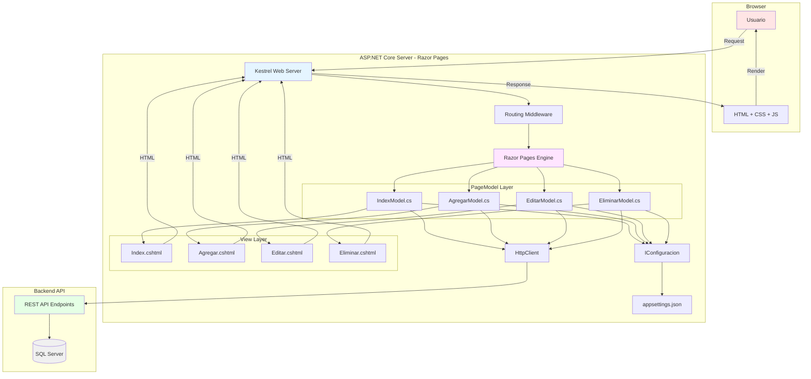
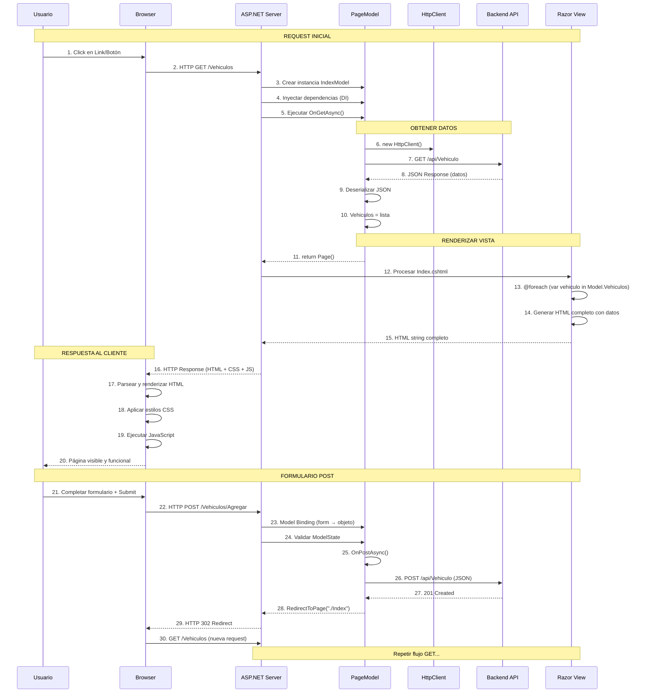
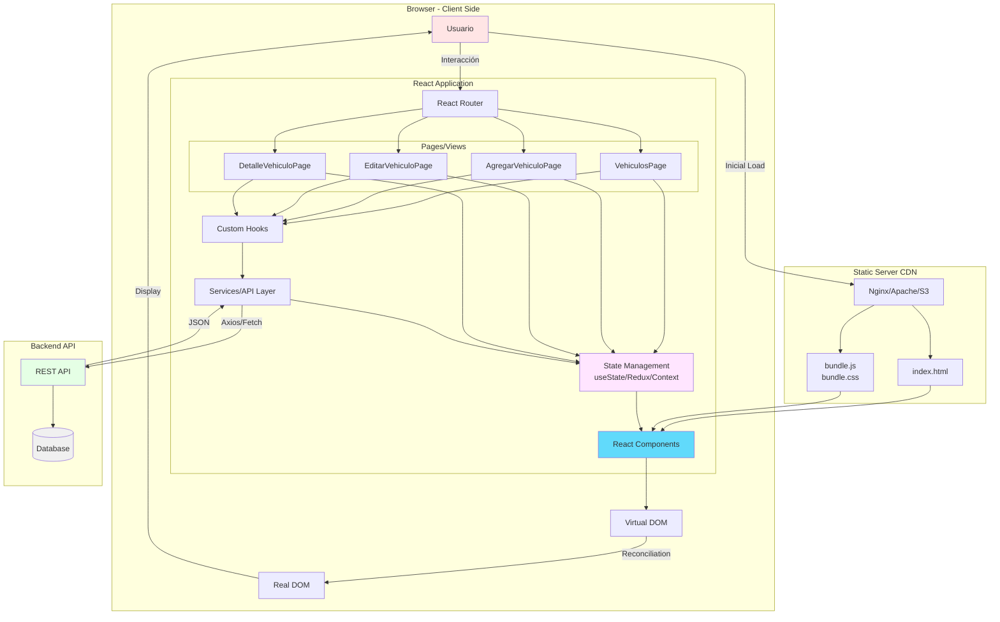
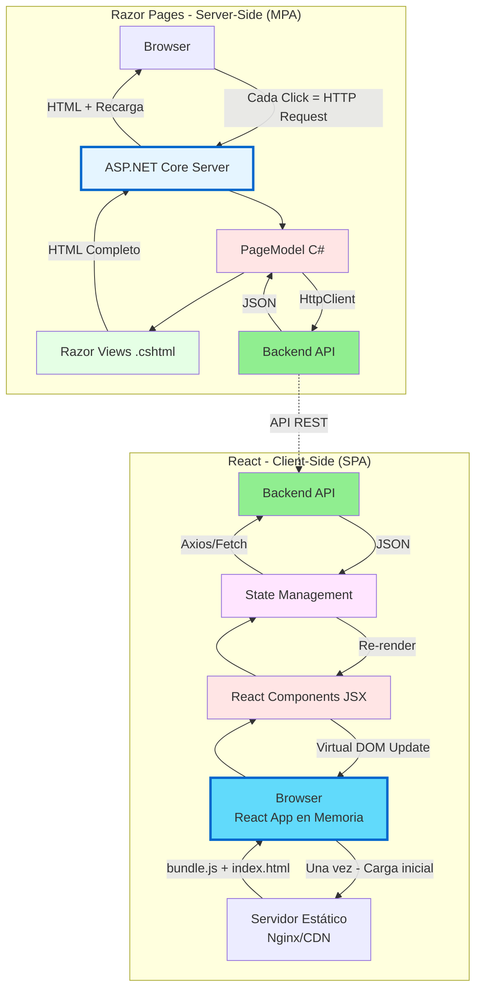
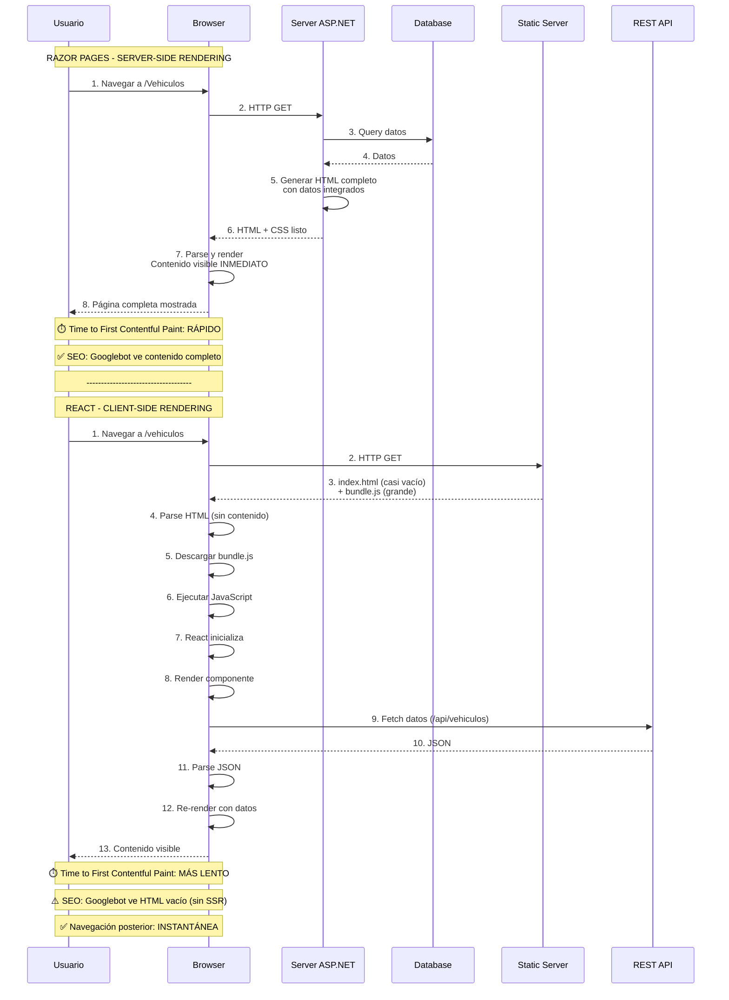
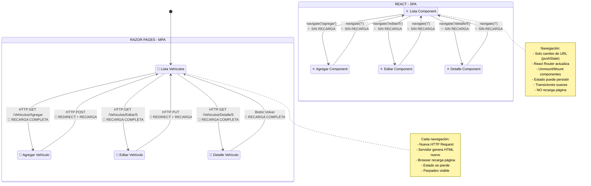
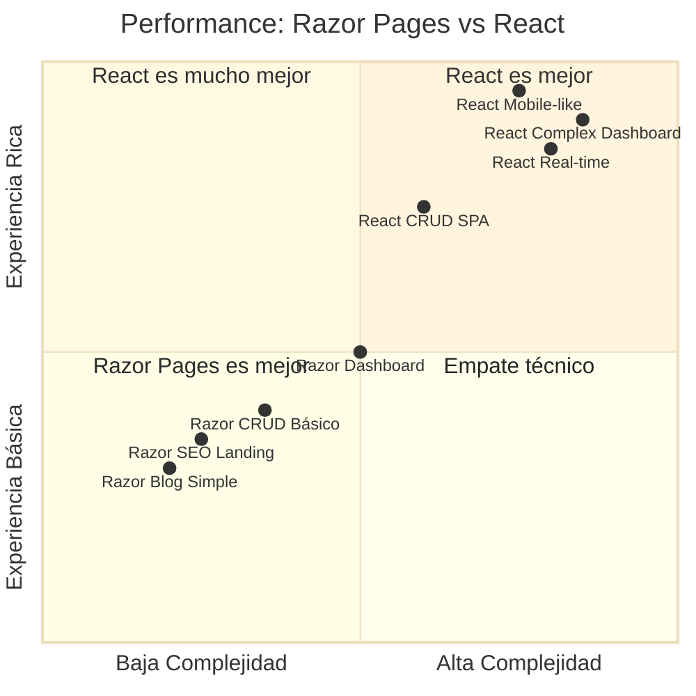
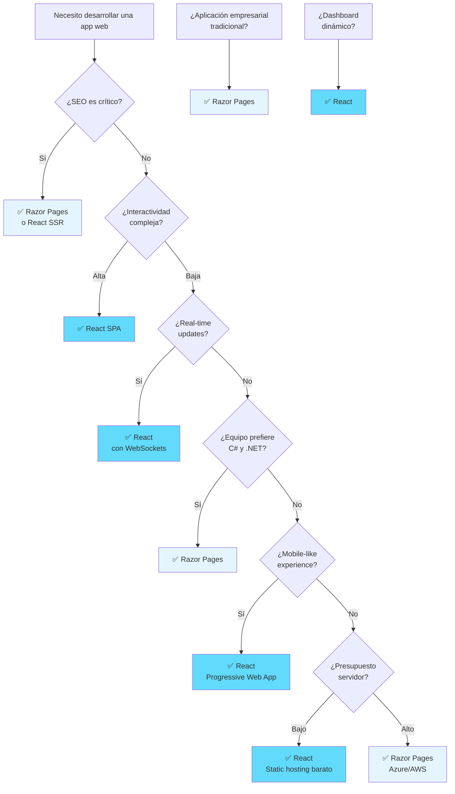

# Razor Pages vs React - Diagramas Comparativos

## 📊 Índice de Diagramas

1. [Arquitectura de Razor Pages](#1-arquitectura-de-razor-pages)
2. [Flujo de Request-Response en Razor Pages](#2-flujo-de-request-response-en-razor-pages)
3. [Ciclo de Vida de una Página Razor](#3-ciclo-de-vida-de-una-página-razor)
4. [Arquitectura de React (SPA)](#4-arquitectura-de-react-spa)
5. [Comparación: Razor Pages vs React - Arquitectura General](#5-comparación-razor-pages-vs-react---arquitectura-general)
6. [Comparación: Flujo de Datos](#6-comparación-flujo-de-datos)
7. [Comparación: Renderizado](#7-comparación-renderizado)
8. [Comparación: Navegación](#8-comparación-navegación)
9. [Comparación: Gestión de Estado](#9-comparación-gestión-de-estado)
10. [Comparación: Performance y Experiencia de Usuario](#10-comparación-performance-y-experiencia-de-usuario)

---

## 1. Arquitectura de Razor Pages



### Características Clave de Razor Pages:

- **Server-Side Rendering (SSR)**: HTML se genera en el servidor
- **Multi-Page Application (MPA)**: Cada acción recarga la página completa
- **PageModel Pattern**: Separación entre lógica (C#) y vista (Razor)
- **Tag Helpers**: Sintaxis limpia para generar HTML
- **HTTP Tradicional**: GET/POST con formularios HTML estándar

---

## 2. Flujo de Request-Response en Razor Pages



### Puntos Clave:

1. **Cada navegación = Nueva request HTTP completa**
2. **HTML generado en servidor** - el cliente solo recibe HTML final
3. **No hay JavaScript de framework** - opcional para interactividad
4. **Estado no persistente** - cada request es independiente
5. **SEO-friendly** - contenido ya en HTML inicial

---

## 3. Ciclo de Vida de una Página Razor

```mermaid
flowchart TD
    A[HTTP Request llega al servidor] --> B{Tipo de Request?}
    
    B -->|GET| C[OnGetAsync/OnGet]
    B -->|POST| D[OnPostAsync/OnPost]
    B -->|PUT| E[OnPutAsync/OnPut]
    B -->|DELETE| F[OnDeleteAsync/OnDelete]
    
    C & D & E & F --> G[PageModel Constructor]
    G --> H[Dependency Injection]
    H --> I[Handler Method Execution]
    
    I --> J{ModelState.IsValid?}
    J -->|No| K[return Page]
    J -->|Sí| L[Lógica de Negocio]
    
    L --> M[Llamadas HTTP al API]
    M --> N[Deserializar Datos]
    N --> O[Asignar a Propiedades]
    
    K --> P[Razor Engine Procesa .cshtml]
    O --> Q{Tipo de Return?}
    
    Q -->|Page| P
    Q -->|RedirectToPage| R[HTTP 302 Redirect]
    Q -->|NotFound| S[HTTP 404]
    Q -->|BadRequest| T[HTTP 400]
    
    P --> U[Evaluar @model]
    U --> V[Ejecutar código Razor<br/>@if, @foreach, @{}]
    V --> W[Procesar Tag Helpers<br/>asp-page, asp-route-id]
    W --> X[Generar HTML completo]
    
    X --> Y[HTTP Response con HTML]
    R --> Y
    S --> Y
    T --> Y
    
    Y --> Z[Browser recibe y renderiza]
    
    style G fill:#E5F5FF
    style I fill:#FFE5E5
    style P fill:#E5FFE5
    style X fill:#FFF5E5
    style Z fill:#F5E5FF
    
    classDef handler fill:#FFE5E5,stroke:#FF0000,stroke-width:2px
    classDef render fill:#E5FFE5,stroke:#00AA00,stroke-width:2px
    class C,D,E,F handler
    class P,U,V,W,X render
```

### Fases del Ciclo:

1. **Request Processing**: Routing y creación de PageModel
2. **Handler Execution**: OnGet/OnPost/OnPut/OnDelete
3. **Data Fetching**: Llamadas a API externo
4. **Rendering**: Razor Engine procesa vista con datos
5. **Response**: HTML completo enviado al cliente

---

## 4. Arquitectura de React (SPA)



### Características Clave de React:

- **Single Page Application (SPA)**: Una sola carga HTML inicial
- **Client-Side Rendering (CSR)**: JavaScript genera contenido
- **Component-Based**: UI dividida en componentes reutilizables
- **Virtual DOM**: Reconciliación eficiente de cambios
- **Estado del Cliente**: Datos persistentes en memoria del navegador

---

## 5. Comparación: Razor Pages vs React - Arquitectura General



### Diferencias Fundamentales:

| Aspecto | Razor Pages | React |
|---------|-------------|-------|
| **Rendering** | Server-Side (HTML completo) | Client-Side (JavaScript) |
| **Navegación** | Full page reload | Virtual navigation (sin reload) |
| **Estado** | Request-based (stateless) | Persistente en memoria |
| **Servidor** | Genera HTML (CPU intensivo) | Solo sirve archivos estáticos |
| **SEO** | Excelente (HTML en respuesta) | Requiere SSR o SSG extra |

---

## 6. Comparación: Flujo de Datos

```mermaid
%%{init: {'theme':'base', 'themeVariables': { 'fontSize':'14px'}}}%%
flowchart LR
    subgraph "Razor Pages - Server-Side Flow"
        direction TB
        RP1[Usuario hace click]
        RP2[HTTP GET Request<br/>al Servidor]
        RP3[PageModel OnGet]
        RP4[HttpClient llama API]
        RP5[API retorna JSON]
        RP6[Deserializar a C# objects]
        RP7[Asignar a propiedades]
        RP8[Razor Engine<br/>genera HTML]
        RP9[HTML completo<br/>al browser]
        RP10[Browser renderiza<br/>RECARGA PÁGINA]
        
        RP1 --> RP2 --> RP3 --> RP4 --> RP5
        RP5 --> RP6 --> RP7 --> RP8 --> RP9 --> RP10
        
        style RP2 fill:#FFE5E5
        style RP8 fill:#E5FFE5
        style RP10 fill:#FFE5FF
    end
    
        subgraph "React - Client-Side Flow"
            direction TB
            R1[Usuario hace click]
            R2[Event Handler<br/>sin HTTP request]
            R3[useState/useEffect]
            R4[Fetch/Axios llama API]
            R5[API retorna JSON]
            R6[Parsear JSON]
            R7[setState actualiza]
            R8[React reconciliation<br/>Virtual DOM]
            R9[Actualiza solo<br/>componentes afectados]
            R10[SIN RECARGA<br/>cambio instantáneo]
            
            R1 --> R2 --> R3 --> R4 --> R5
            R5 --> R6 --> R7 --> R8 --> R9 --> R10
            
            style R2 fill:#61DAFB
            style R8 fill:#61DAFB
            style R10 fill:#90EE90
        end
    
    style RP1 fill:#FFFFAA
    style R1 fill:#FFFFAA
```



### Análisis de Flujo:

#### Razor Pages:
- ✅ Servidor controla todo el flujo
- ✅ Datos nunca expuestos al cliente (más seguro)
- ❌ Cada acción requiere round-trip al servidor
- ❌ Recarga completa de página (parpadeo)

#### React:
- ✅ Navegación instantánea (sin recarga)
- ✅ Actualización selectiva de UI
- ❌ Lógica expuesta en cliente (puede ser riesgo)
- ❌ Carga inicial más pesada (todo el bundle)

---

## 7. Comparación: Renderizado



### Tiempos de Renderizado:

| Métrica | Razor Pages | React CSR | React SSR |
|---------|-------------|-----------|-----------|
| **First Load** | Rápido (HTML listo) | Lento (JS + data) | Rápido (híbrido) |
| **Time to Interactive** | Rápido | Moderado | Moderado |
| **Navegación** | Lento (reload) | Instantáneo | Instantáneo |
| **SEO** | Excelente | Malo | Excelente |

---

## 8. Comparación: Navegación



### Experiencia de Usuario:

#### Razor Pages (MPA):
- ✅ URLs significativas y compartibles
- ✅ Botón back/forward del browser funciona naturalmente
- ❌ Parpadeo en cada navegación
- ❌ Pérdida de estado (ej: posición scroll)
- ❌ Re-descarga assets (CSS/JS) si no hay cache

#### React (SPA):
- ✅ Navegación fluida sin parpadeo
- ✅ Animaciones y transiciones suaves
- ✅ Estado persistente entre navegaciones
- ⚠️ Requiere configuración para SEO y deep linking
- ⚠️ Botón back/forward requiere React Router

---

## 9. Comparación: Gestión de Estado

```mermaid
graph TB
    subgraph "Razor Pages - Stateless"
        RP_Req1[Request 1:<br/>GET /Vehiculos]
        RP_PM1[PageModel<br/>Vehiculos = null]
        RP_API1[API Call]
        RP_Data1[Vehiculos = lista]
        RP_HTML1[HTML generado]
        RP_Destroy1[💀 PageModel destruido<br/>Estado perdido]
        
        RP_Req2[Request 2:<br/>GET /Vehiculos/Agregar]
        RP_PM2[Nuevo PageModel<br/>Fresh start]
        RP_NoState[❌ No hay estado previo<br/>Todo desde cero]
        
        RP_Req1 --> RP_PM1 --> RP_API1 --> RP_Data1
        RP_Data1 --> RP_HTML1 --> RP_Destroy1
        RP_Destroy1 --> RP_Req2 --> RP_PM2 --> RP_NoState
        
        note1[Cada request es independiente<br/>No hay memoria entre páginas]
        RP_NoState --- note1
        
        style RP_Destroy1 fill:#FFE5E5
        style RP_NoState fill:#FFE5E5
    end
    
    subgraph "React - Stateful"
        R_Init[App inicializa]
        R_State[const vehiculos, setVehiculos = useState]
        R_Load[useEffect fetch API]
        R_Data[setVehiculos lista]
        R_Persist[✅ Estado en memoria]
        
        R_Nav1[Navigate a /agregar]
        R_Keep1[✅ Estado persiste<br/>vehiculos todavía en memoria]
        
        R_Nav2[Navigate back a /]
        R_Keep2[✅ Lista aún disponible<br/>No re-fetch necesario]
        
        R_Global[Context API / Redux<br/>Estado global compartido]
        
        R_Init --> R_State --> R_Load --> R_Data
        R_Data --> R_Persist
        R_Persist --> R_Nav1 --> R_Keep1
        R_Keep1 --> R_Nav2 --> R_Keep2
        R_Keep2 -.-> R_Persist
        R_State --> R_Global
        
        note2[Estado persiste mientras<br/>app está activa]
        R_Global --- note2
        
        style R_Persist fill:#90EE90
        style R_Keep1 fill:#90EE90
        style R_Keep2 fill:#90EE90
    end
    
    style RP_Req1 fill:#E5F5FF
    style RP_Req2 fill:#E5F5FF
    style R_Init fill:#61DAFB
```



### Estrategias de Estado:

#### Razor Pages:
- **TempData**: Persistir entre redirects (una sola vez)
- **Session**: Almacenar en servidor (consume memoria)
- **Cookies**: Pequeños datos en cliente
- **Query String**: Pasar datos en URL
- **Hidden Fields**: Mantener en formulario

#### React:
- **useState**: Estado local de componente
- **useContext**: Compartir entre componentes cercanos
- **Redux/Zustand**: Estado global centralizado
- **React Query**: Cache de datos de API
- **Local Storage**: Persistencia en navegador

---

## 10. Comparación: Performance y Experiencia de Usuario



### Matriz de Decisión:



---

## 📊 Tabla Comparativa Final

| Criterio | Razor Pages (MPA) | React (SPA) | Ganador |
|----------|-------------------|-------------|---------|
| **SEO out-of-the-box** | ✅ Excelente | ❌ Requiere SSR | Razor Pages |
| **Time to First Paint** | ✅ Rápido | ⚠️ Moderado | Razor Pages |
| **Navegación fluida** | ❌ Recarga | ✅ Instantánea | React |
| **Estado persistente** | ❌ Solo con Session | ✅ Nativo | React |
| **Curva aprendizaje** | ✅ Más simple | ⚠️ Más compleja | Razor Pages |
| **Hosting** | ⚠️ Servidor ASP.NET | ✅ CDN estático | React |
| **Costo servidor** | ⚠️ Mayor (CPU) | ✅ Menor | React |
| **Seguridad** | ✅ Lógica oculta | ⚠️ Lógica expuesta | Razor Pages |
| **Interactividad** | ⚠️ Con JS extra | ✅ Nativa | React |
| **Real-time** | ❌ Complejo | ✅ Natural | React |
| **Debugging** | ✅ Visual Studio | ⚠️ Dev Tools | Razor Pages |
| **TypeScript** | ❌ Solo JS | ✅ Primera clase | React |
| **Testing** | ✅ Unit + Integration | ✅ Unit + E2E | Empate |
| **Mobile experience** | ❌ Básica | ✅ App-like | React |
| **Offline support** | ❌ No | ✅ PWA | React |

---

## 🎯 Casos de Uso Recomendados

### Usar **Razor Pages** cuando:

- ✅ Aplicación tipo **CRUD empresarial** tradicional
- ✅ **SEO es crítico** (e-commerce, blogs, marketing)
- ✅ Equipo tiene experiencia en **C# y .NET**
- ✅ Presupuesto limitado (no requiere desarrollador JS)
- ✅ Aplicación con **formularios complejos** (model binding)
- ✅ **Seguridad** es prioritaria (lógica en servidor)
- ✅ Necesitas **integración profunda con .NET** (Identity, EF)
- ✅ Clientes con **conexión lenta** (páginas ligeras)

### Usar **React** cuando:

- ✅ Experiencia **tipo aplicación móvil** en web
- ✅ Dashboards con **datos en tiempo real**
- ✅ Muchas **interacciones sin recarga**
- ✅ **PWA** (Progressive Web App) con offline support
- ✅ Equipo especializado en **JavaScript/TypeScript**
- ✅ API ya existe y solo necesitas **frontend**
- ✅ **Microservicios**: frontend independiente
- ✅ Necesitas **animaciones complejas** y transiciones

### **Híbrido** (lo mejor de ambos):

- 🔄 **Next.js con React**: SSR + SPA navigation
- 🔄 **Blazor Server**: Razor con interactividad (SignalR)
- 🔄 **Razor Pages + React Islands**: Páginas SSR con componentes interactivos

---

## 🔍 Ejemplo Práctico: CRUD de Vehículos

### Razor Pages - Agregar Vehículo
```
1. Usuario navega a /Vehiculos/Agregar
2. Servidor ejecuta AgregarModel.OnGetAsync()
3. Carga marcas/modelos desde API
4. Genera HTML con formulario pre-poblado
5. Usuario completa y presiona Submit
6. POST /Vehiculos/Agregar con form data
7. Servidor ejecuta AgregarModel.OnPostAsync()
8. Valida ModelState
9. Envía JSON al API
10. RedirectToPage("./Index")
11. Nueva request GET /Vehiculos
12. Página lista actualizada
```

### React - Agregar Vehículo
```
1. Usuario hace click "Agregar"
2. navigate('/agregar') - SIN HTTP REQUEST
3. AgregarComponent monta
4. useEffect fetches marcas/modelos (una vez)
5. Usuario completa formulario
6. onSubmit handler
7. Validación en cliente (yup/zod)
8. fetch('/api/vehiculo', {method: 'POST', body: JSON})
9. await respuesta
10. navigate('/') - SIN RECARGA
11. ListComponent ya tiene estado o refetch
12. Lista actualizada instantáneamente
```

**Diferencia clave**: 
- Razor Pages: **3 HTTP requests** (GET form + POST data + GET redirect)
- React: **2 HTTP requests** (GET marcas/modelos + POST vehículo), navegación instantánea

---

## 📚 Recursos Adicionales

### Razor Pages
- [Microsoft Docs - Razor Pages](https://learn.microsoft.com/aspnet/core/razor-pages)
- [Razor Pages vs MVC](https://learn.microsoft.com/aspnet/core/tutorials/choose-web-ui)

### React
- [React Official Docs](https://react.dev)
- [React Router](https://reactrouter.com)
- [Next.js (React SSR)](https://nextjs.org)

### Comparativas
- [SPA vs MPA](https://developer.mozilla.org/en-US/docs/Glossary/SPA)
- [SSR vs CSR](https://web.dev/rendering-on-the-web/)

---

**Conclusión**: No hay un ganador absoluto. La elección depende de los **requisitos específicos del proyecto**, **experiencia del equipo** y **objetivos de negocio**.
